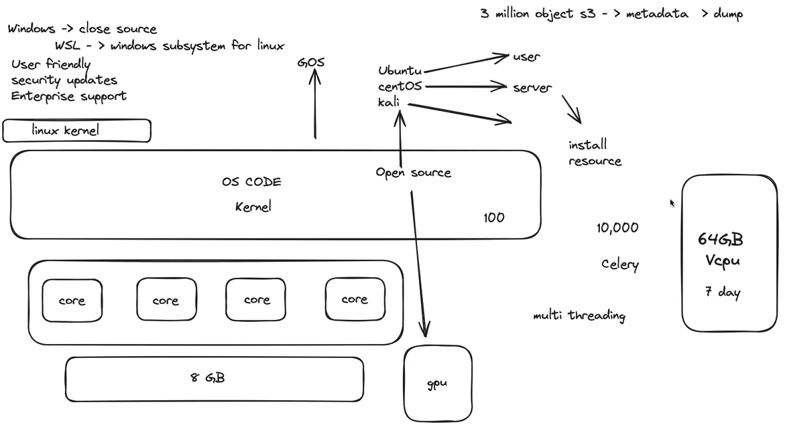
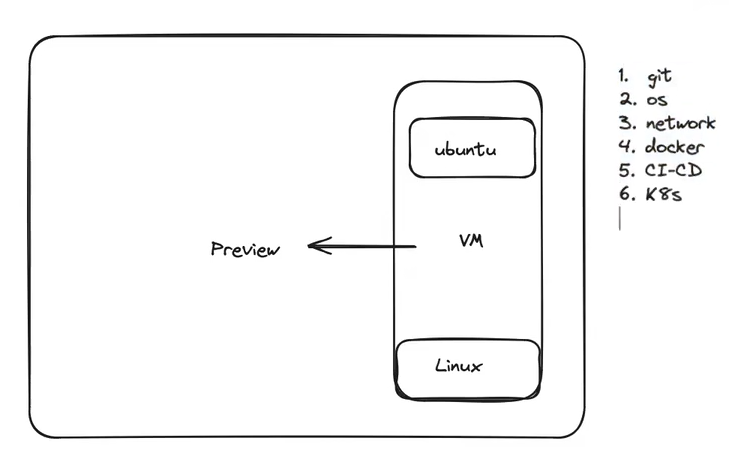

## Contents
- [unix](#unix)
- [kernel](#kernel)
- [wsl](#wsl)
- [vm](#vm)

# unix
# kernel


# wsl


# vm
# Commands
## ls
#### Description: Lists files and directories in the current directory.
```
ls  # Lists all files and directories
ls -a  # Lists all files and directories, including hidden ones
ls -l  # Lists files in long format, showing details like permissions, owner, size, and modification time
ls -l -a  # Lists files in long format, showing details like permissions, owner, size, and modification time, including hidden files
ls -lh  # Lists files in long format with human-readable file sizes
ls -lh -a  # Lists files in long format with human-readable file sizes, including hidden files
ls -t  # Sorts files by modification time
ls -t -a  # Sorts files by modification time, including hidden files
ls -r  # Reverses the order of listing
ls -r -a  # Reverses the order of listing, including hidden files
```
## |
### The | Pipe Command in Linux
- chaining commands together


```
ls -l | grep "myfile.txt"

In this example:

    ls -l lists files in a long format.
    The output of ls -l is piped/chained to grep/search "myfile".
    grep "myfile" searches for lines containing "myfile" in the input (which is the output of ls -l).
```

```
ps aux | grep 'python' | sort -k 4  # Lists processes, filters for Python processes, and sorts them by memory usage.

find . -name "*.txt" | wc -l # Counts the number of text files in the current directory and its subdirectories.

cat files.txt | wc -w  # Counts the number of words in the files.txt file.
```

## whoami
- print the username of the user currently logged into the system.
## su
- switch to another user account on the system.
```
su user1
```
## cd
```
cd directory_name
```

| Command               | Explanation                                                    |
| --------------------- | -------------------------------------------------------------- |
| `cd Documents`        | Changes to the "Documents" directory.                          |
| `cd ..`               | Moves to the parent directory.                                 |
| `cd ~`                | Goes to the home directory.                                    |
| `cd /`                | Goes to the root directory.                                    |
| `cd ../Downloads`     | Goes to the "Downloads" directory in the parent directory.     |
| `cd ./Documents/Work` | Goes to the "Work" directory within the "Documents" directory. |


## cat
| Command                             | Explanation                                                                                       |
| ----------------------------------- | ------------------------------------------------------------------------------------------------- |
| `cat filename.txt`                  | Displays the contents of the file `filename.txt` on the terminal.                                 |
| `cat file1.txt file2.txt file3.txt` | Concatenates and displays the contents of `file1.txt`, `file2.txt`, and `file3.txt` sequentially. |
| `cat > input.txt`                   | Opens a text editor-like interface to input text, which is then saved to the file `input.txt`.    |

## pwd
```
# Print the current working directory
pwd

# Print the working directory of a specific file
pwd /path/to/file.txt

```
## grep
-  searches for the specified pattern within the given file
```
grep "search_pattern" filename.txt

# Search for the word "error" in the file "log.txt"
grep "error" log.txt

# Search for lines starting with "warning" in the file "system.log"
grep "^warning" system.log

# Search for lines containing "keyword" in all files in the current directory
grep "keyword" *
```

| Option | Description                                                    |
| ------ | -------------------------------------------------------------- |
| -i     | Case-insensitive search.                                       |
| -v     | Invert the match, showing lines that do not match the pattern. |
| -n     | Display line numbers with the matching lines.                  |
| -c     | Count the number of matching lines.                            |
| -w     | Match whole words only.                                        |


```
grep -i -n "error" log.txt
grep -i -n 'error' 2.linux/linux.md
```
## echo
- print text to the terminal
- print the message "Hello, world!" to the console.
```
echo "Hello, world!"

echo "This is a single line of text."
echo "This is a 
multiline 
text."
echo "The current date and time is: $(date)"
```

| Command                                        | Explanation                                                            |
| ---------------------------------------------- | ---------------------------------------------------------------------- |
| `echo "Hello, world!"`                         | Prints the text "Hello, world!" to the console.                        |
| `echo "This is a \nmultiline \ntext."`         | Prints the text in multiple lines.                                     |
| `echo "The current date and time is: $(date)"` | Executes the `date` command and prints its output along with the text. |


## touch

| Command                               | Explanation                                                       |
| ------------------------------------- | ----------------------------------------------------------------- |
| `touch filename.txt`                  | Creates a new file named `filename.txt` or updates its timestamp. |
| `touch file1.txt file2.txt file3.txt` | create multiple files                                             |

## >

- If the file already exists, it will be overwritten
- 
```
command > filename.txt
```

| Command                     | Explanation                                                              |
| --------------------------- | ------------------------------------------------------------------------ |
| `echo 'hello' > 'file.txt'` | Prints the text "hello" and redirects the output to the file `file.txt`. |

| Command                                | Explanation                                                                                  |
| -------------------------------------- | -------------------------------------------------------------------------------------------- |
| `echo 'Hello, world!' > greeting.txt`  | Prints "Hello, world!" to the file `greeting.txt`.                                           |
| `date > today.txt`                     | Writes the current date and time to the file `today.txt`.                                    |
| `ls -la > file_list.txt`               | Lists files in long format and saves the output to `file_list.txt`.                          |
| `grep 'error' log.txt > error_log.txt` | Searches for lines containing "error" in `log.txt` and saves the matches to `error_log.txt`. |

## >>

| Command                                 | Explanation                                                                |
| --------------------------------------- | -------------------------------------------------------------------------- |
| `date >> log.txt`                       | Appends the current date and time to the file `log.txt`.                   |
| `grep 'error' log.txt >> error_log.txt` | Appends lines containing "error" from `log.txt` to `error_log.txt`.        |
| `tail -f log.txt >> backup_log.txt`     | Continuously monitors `log.txt` and appends new lines to `backup_log.txt`. |

## sed
- a powerful stream editor that allows you to manipulate text in files

```
sed 's/old_word/new_word/g' test.txt

echo 'hello world' > test.txt
sed 's/world/saifur/g' test.txt
```

```
# Delete the first line of a file
sed '1d' test.txt

# Insert a new line at the beginning of a file
sed '1i\New line' filename.txt

# Print only lines containing "keyword"
sed '/keyword/!d' filename.txt

```

## mkdir

| Command                      | Explanation                                                             |
| ---------------------------- | ----------------------------------------------------------------------- |
| `mkdir new_folder`           | Creates a new directory named "new_folder".                             |
| `mkdir -p path/to/directory` | Creates the directory "directory" and any necessary parent directories. |
| `mkdir dir1 dir2 dir3`       | Creates multiple directories: "dir1", "dir2", and "dir3".               |

## package manager (yum, apt, brew, chocolaty)
| Package Manager | Operating System                             | Description                                                               |
| --------------- | -------------------------------------------- | ------------------------------------------------------------------------- |
| **yum**         | Red Hat-based systems (RHEL, CentOS, Fedora) | Package manager for installing, updating, and removing software packages. |
| **apt**         | Debian-based systems (Ubuntu, Debian, Mint)  | Package manager for installing, updating, and removing software packages. |
| **brew**        | macOS                                        | Package manager for installing software packages from the command line.   |
| **chocolatey**  | Windows                                      | Package manager for Windows, similar to apt or yum.                       |


## apt-get

| Command | Explanation |
|---|---|
| `sudo apt-get update` | Updates the package lists. |
| `sudo apt-get upgrade` | Upgrades all installed packages to their latest versions. |
| `sudo apt-get install package_name` | Installs the specified package. |
| `sudo apt-get remove package_name` | Removes the specified package. |
| `sudo apt-get autoremove` | Removes unused dependencies. |
